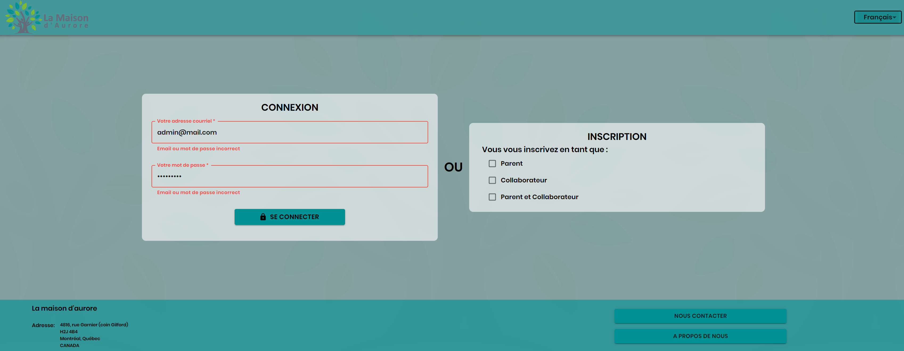

## Project La Maison d'Aurore
La Maison d'Aurore is an non-profit association situated in Montréal whose mission is to help daily life of elderly and to assist school homework for disadvantaged chidren in the community.

The manager of the association used only excel to register association members, manage classrooms, and manage schedules. She needs a more technological savvy tool to boost the efficiency of the association management.

It is in this context, we, a team of 7 members are mandated by the association to create a management tool to replace the excel based model to do the registration, management of classrooms, schedules etc.

The App has the following fonctions:

- Sign in and Sign up for parents, children, administrator, super administrator, and coordinators (who are volunteers of the association)
- Validation of sign in (by administrator or super administrator)
- Management of schedules
- Management of classroom occupations
- Track historical records of events
- Track and register the presence of childrens (by Mobile app)

The App consists of a RESTFUL backend built with MongoDB and Express, a web front end built with React and Material UI, and a mobile front end buit with Java and Android Studio.

## Tech Stack
Backend / Server: MongoDB, Mongoose, NodeJS, Express
FrontEnd: ReactJS, React Router, MaterialUI, Webpack, JWT

## Installation
Open the folder with the console, type `npm install` + enter. After the installation finished, type `npm run dev` + enter, wait the browser opens.
Now you can see the connection page, you can use your credentials to login.

## Preview

